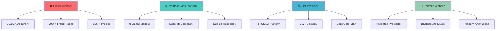
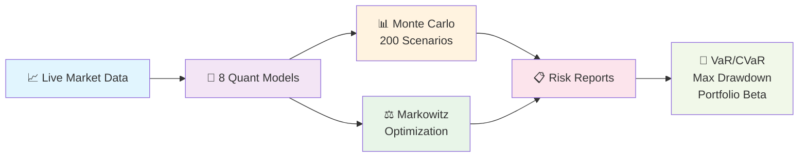
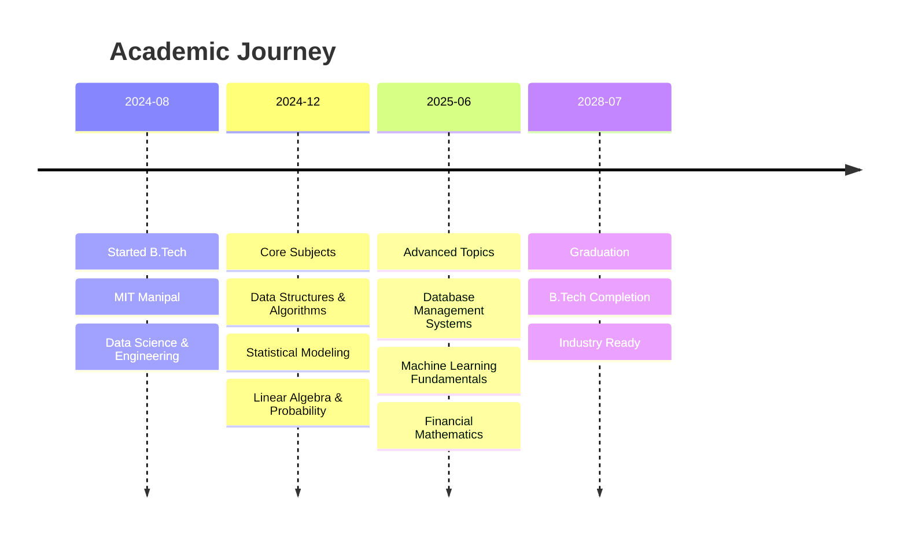
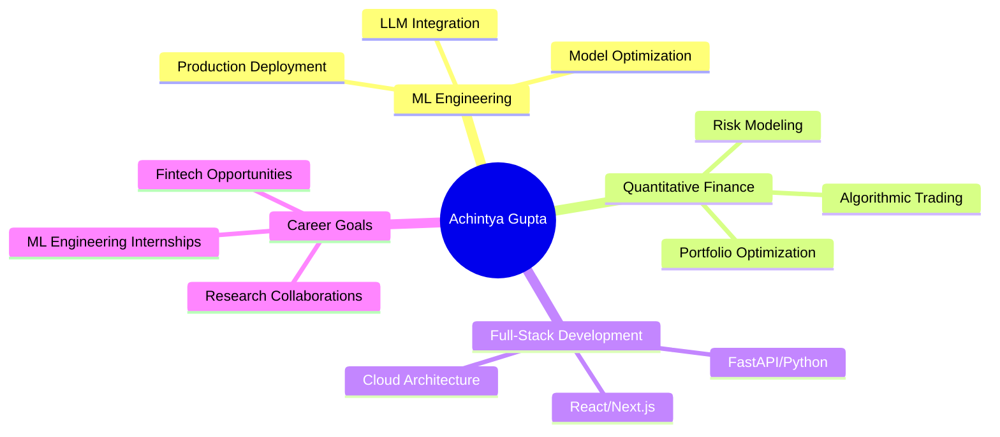

<div align="center">

# 🚀 ACHINTYA GUPTA - PORTFOLIO 🚀


<p align="center">
  
  
  
</p>

<p align="center">
  <a href="https://linkedin.com/in/achintya-gupta-bb0091311">
    
  </a>
  <a href="https://github.com/AchintyaCodes">
    
  </a>
  <a href="mailto:achintya.mann@gmail.com">
    
  </a>
  <a href="https://achintya-portfolio.vercel.app">
    
  </a>
</p>

---

## 🎯 ABOUT ME


```yaml
name: "Achintya Gupta"
education: "B.Tech Data Science & Engineering @ MIT Manipal"
year: "Second Year (Aug 2024 - Present)"
location: "Udupi, India"
email: "achintya.mann@gmail.com"

focus_areas:
  - "ML Engineering & Quantitative Analytics"
  - "Financial Technology & Risk Modeling"
  - "LLM Integration & Process Automation"
  - "Scalable Infrastructure & Full-Stack Development"

production_systems: 4
fraud_prevention_impact: "$2M+"
model_accuracy: "99.85%"
certifications: 4
```

> **"Building robust software, automating the complex and focused on transforming static systems into intelligent ones."**

---

## 🔥 PRODUCTION SYSTEMS DEPLOYED

<div align="center">



</div>

---

## 🚀 FEATURED PROJECTS

### 🛡️ FraudGuard AI - LLM-Powered Fraud Detection
<details>
<summary><b>🔍 Click to expand technical details</b></summary>

<div align="center">

| Metric | Value | Impact |
|--------|-------|--------|
| 🎯 **Accuracy** | `99.85%` | Industry-leading performance |
| 📊 **AUC-ROC** | `0.968` | Exceptional model quality |
| ⚡ **Fraud Recall** | `70%+` | Superior detection rate |
| 💰 **Impact** | `$2M+` | Production-scale prevention |
| ⏱️ **Report Gen** | `<3 seconds` | Real-time compliance |

</div>

**🛠️ Tech Stack:**
```
Frontend: Next.js, TypeScript, Tailwind CSS
Backend:  FastAPI, Python, XGBoost, SHAP
AI/ML:    Llama 3.3 70B, Groq API, SMOTE
Deploy:   Vercel, Hugging Face Hub
```

**🎯 Key Features:**
- 🤖 **LLM Integration**: Llama 3.3 70B for Basel III compliant audit narratives
- 📈 **ML Pipeline**: XGBoost with SMOTE resampling on 284,807 transactions
- 📊 **Explainability**: SHAP integration for transparent decision-making
- 📄 **Compliance**: One-click PDF report generation with animated dashboards

**🔗 Links:** [Live Demo](https://fraudguard-ai-omega.vercel.app/) | [GitHub](https://github.com/AchintyaCodes/fraud-audit-llm)

</details>

---

### 📊 Quantitative Portfolio Risk Platform
<details>
<summary><b>🔍 Click to expand technical details</b></summary>

<div align="center">



</div>

**🛠️ Tech Stack:**
```
Backend:  Python, FastAPI, NumPy, SciPy, Pandas
Frontend: Next.js, TypeScript, Chart.js
Models:   Monte Carlo, Markowitz, VaR/CVaR
Deploy:   Cloud-hosted with sub-2s response
```

**🎯 Key Features:**
- 🎲 **Monte Carlo Simulation**: 200 scenarios, 252-day horizon
- 📊 **Risk Metrics**: VaR (95%/99%), CVaR, Maximum Drawdown, Beta
- 🏛️ **Basel III Compliance**: Institutional-grade risk reporting
- ⚡ **Performance**: Sub-2s response across 6 macro stress scenarios

**🔗 Links:** [Live Demo](https://portfolio-risk-intelligence-platfor.vercel.app/) | [GitHub](https://github.com/AchintyaCodes)

</details>

---

### 💰 FinFlow - Full-Stack Financial Analytics Platform
<details>
<summary><b>🔍 Click to expand technical details</b></summary>

<div align="center">

| Component | Technology | Feature |
|-----------|------------|---------|
| 🔐 **Auth** | JWT + bcrypt | Secure authentication |
| 🗄️ **Database** | PostgreSQL | Serverless on Neon |
| 🎨 **Frontend** | Next.js + TypeScript | Real-time dashboards |
| ⚡ **Backend** | FastAPI | 4 CRUD modules |
| 🚀 **Deploy** | Vercel | Zero cold-start |

</div>

**🛠️ Architecture:**
```
┌─────────────────┐    ┌──────────────────┐    ┌─────────────────┐
│   Next.js UI   │───▶│   FastAPI Core   │───▶│  PostgreSQL DB  │
│  TypeScript     │    │   JWT Security   │    │   Neon Cloud    │
│  Tailwind CSS   │    │   4 CRUD APIs    │    │   Serverless    │
└─────────────────┘    └──────────────────┘    └─────────────────┘
```

**🎯 Key Features:**
- 🏗️ **Full-SDLC**: Architecture to CI/CD deployment
- 🔒 **Security**: JWT/bcrypt application security
- 📊 **Analytics**: Real-time revenue visualization
- ⚡ **Performance**: Zero cold-start latency

**🔗 Links:** [Live Demo](https://finflow-dashboard-virid.vercel.app/) | [GitHub](https://github.com/AchintyaCodes)

</details>

---

## 🛠️ TECHNICAL ARSENAL

<div align="center">

### 💻 Programming Languages
<p>
  
  
  
  
  
  
  
</p>

### 🤖 ML & Data Science
<p>
  
  
  
  
  
  
</p>

### 🏦 Quantitative Finance
<p>
  
  
  
  
  
</p>

### ☁️ Cloud & DevOps
<p>
  
  
  
  
  
</p>

### 🎨 Frontend & Frameworks
<p>
  
  
  
  
  
</p>

</div>

---

## 🏆 ACHIEVEMENTS & RECOGNITION

<div align="center">

| 🏅 Achievement | 📊 Details | 🎯 Impact |
|----------------|------------|-----------|
| **🏆 Case-a-thon 2026** | Round 2/3 (438 participants) | MIT Manipal Strategy & Business |
| **🌟 GSSoC 2026** | Selected Contributor | AI/Agents Track (30K+ participants) |
| **📜 Google Analytics** | Professional Certificate | Data Analytics Expertise |
| **🐍 IBM Python** | Data Science Certificate | Advanced Python Skills |
| **📊 Meta Analytics** | Professional Certificate | Meta Platform Analytics |
| **💼 McKinsey Forward** | Program Completion | Strategic Business Thinking |

</div>

---

## 🎓 EDUCATION

<div align="center">



</div>

**🏫 Manipal Institute of Technology, MAHE**  
📅 **Duration:** Aug 2024 – July 2028  
🎓 **Degree:** B.Tech in Data Science & Engineering  
📍 **Location:** Udupi, India  

**📚 Relevant Coursework:**
- 🧮 Data Structures & Algorithms
- 📊 Statistical Modeling  
- 🔢 Linear Algebra & Probability
- 🗄️ Database Management Systems

---

## 💼 PROFESSIONAL EXPERIENCE

<div align="center">

### 🚀 AIESEC, Manipal Institute of Technology
**Technology & Operations Lead (Student Volunteer)**  
📅 Feb 2025 – Present | 📍 Udupi, India

</div>

<details>
<summary><b>🔍 Click to see detailed achievements</b></summary>

**🎯 Key Accomplishments:**

| 📊 Metric | 📈 Before | 📈 After | 🚀 Improvement |
|-----------|----------|----------|----------------|
| **Reporting Lag** | 2 days | Real-time | ⚡ 40% reduction |
| **Conversion Rate** | <20% | 35% | 📈 75% increase |
| **Cycle Time** | Baseline | Optimized | ⚡ 30% faster |
| **Revenue Generated** | $0 | $1,600+ | 💰 New revenue stream |

**🛠️ Technical Implementations:**
- 🐍 **Python Automation**: Google Sheets API integration
- 📊 **Real-time Dashboards**: 100% pipeline data consolidation  
- 🎯 **Process Optimization**: Identified 3 critical workflow failures
- 👥 **Team Leadership**: Coordinated team of 7 members

**📈 Business Impact:**
- 📋 Eliminated manual spreadsheet tracking across 50+ enterprise accounts
- 🎯 Restructured outreach targeting and pitch sequencing
- ⚡ Reduced operational overhead and increased throughput by 30%
- 💼 Enabled same-day decision-making for leadership team

</details>

---

## 🌐 PORTFOLIO WEBSITE FEATURES

<div align="center">


### 🎨 Interactive Elements

| Feature | Technology | Description |
|---------|------------|-------------|
| 🎵 **Background Music** | Web Audio API | Custom controls with volume adjustment |
| ⚡ **Insane Preloader** | GSAP + CSS3 | Animated counter and loading bars |
| 🎨 **Modern Animations** | Framer Motion | Smooth transitions and parallax |
| 📱 **Responsive Design** | Tailwind CSS | Optimized for all devices |
| 🎯 **Interactive UI** | React + TypeScript | Smooth scrolling and hover effects |

</div>

**🚀 Built With:**
```yaml
Frontend Framework: React 18 + TypeScript
Styling: Tailwind CSS + Custom CSS
Animations: Framer Motion + GSAP
Smooth Scrolling: Lenis
Deployment: Vercel
Performance: Optimized for Core Web Vitals
```

**✨ Special Features:**
- 🎵 Background music with skip functionality (starts at 5s)
- ⚡ Animated preloader with counting animation
- 🎨 Glassmorphism design elements
- 📱 Mobile-first responsive design
- 🎯 Interactive project showcases with live demos

---

## 📊 GITHUB STATISTICS

<div align="center">


</div>

---

## 🎯 CURRENT FOCUS

<div align="center">



</div>

**🎯 Seeking Opportunities In:**
- 🤖 **ML Engineering**: Production ML systems and LLM integration
- 📊 **Quantitative Analytics**: Financial modeling and risk assessment  
- 🏦 **Financial Technology**: Fintech startups and trading firms
- 🔬 **Research**: Academic collaborations in ML and finance

---

## 📫 GET IN TOUCH

<div align="center">

 <em><b>I love connecting with different people</b> so if you want to say <b>hi, I'll be happy to meet you more!</b> 😊</em>

<p>
  <a href="mailto:achintya.mann@gmail.com">
    
  </a>
</p>

<p>
  <a href="https://linkedin.com/in/achintya-gupta-bb0091311">
    
  </a>
</p>

<p>
  <a href="https://github.com/AchintyaCodes">
    
  </a>
</p>

<p>
  <a href="https://achintya-portfolio.vercel.app">
    
  </a>
</p>

</div>

---

<div align="center">

### 🚀 Let's Build Something Amazing Together! 🚀


**"Building robust software, automating the complex and focused on transforming static systems into intelligent ones."**

<p>
  
  
</p>

---

<sub>⭐ **Made with ❤️ by Achintya Gupta** ⭐</sub>

</div>